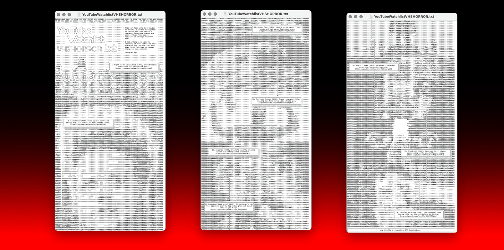

I accidentally made a kind of ASCII YouTube VHS Horror 'zine in a .txt file

[YouTubeWatchlistVHSHORROR.txt](https://raw.githubusercontent.com/aaiiintt/youtubewatchlist.txt/main/YouTubeWatchlistVHSHORROR.txt) - this text file contains YouTube links to a bunch of films I watched as a teenager on crappy VHS tapes.

☝️☝️ TEXT FILE HERE ☝️☝️

---

**CREDIT:**
Most of the video links were sourced from these two amazing YouTube playlists 
- [Bob's super awesome B-movie playlist!!!](https://youtube.com/playlist?list=PLAx7GszKPjfhcCAwDVnQH7VLXyZsl5Bog&si=MjTgHb1nRZuJ35Xi)
- [BIG FAT CULT - Horror, Cult, B Movies, Video Nasties & More!](https://youtube.com/playlist?list=PLFFjziTVgklgq8HULzkZbtG2lFjY5E-qS&si=zIk0RziB5uQxmiLu)
Go explore, you'll find hundreds of gems.

I used Monodraw (https://monodraw.helftone.com) to lay out the text file.

And to create the ASCII art I used the wonderful https://ascii-generator.site - [Github](https://github.com/hermanTenuki/ASCII-Generator.site) - 
Thank you :-)
